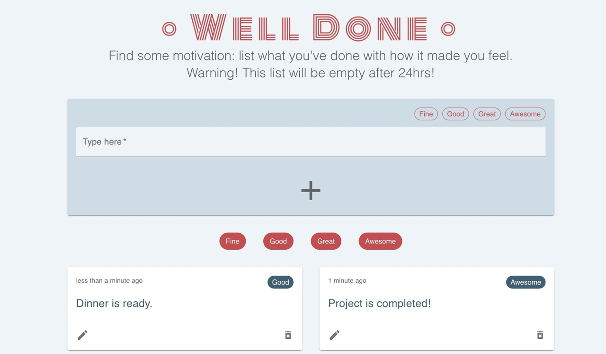

# Project Well Done

My solution for a code test in a recruitment process: build a TypeScript React CRUD app

## Task for this code test

Build a simple CRUD web app using a temporary endpoint from [CrudCrud](https://crudcrud.com/), with any frontend framework.

## My comments

### Steps

Here are the steps I went through:

- I decided which kind of data the app would deal with, made a quick sketch of what I wanted it to look like and decided to use Material UI components to simplify the styling.
- I tested the endpoint in Postman for each action (create, read, update, delete).
- I built the folders structure in the repo.
- I created all components and other useful files.
- I created some basic unit tests.
- I read on CD/CI flow and set up one workflow running the tests.
- I used conventional commits all along the way, as I like clean and structured work.

### Deployed app

[https://well-done-list.netlify.app/](https://well-done-list.netlify.app/)

### General comments

**App features**

_Comment:_ Data consists in actions, and each object has four properties: `_id` (automatically generated via CrudCrud API), `text` (input by user), `feeling` (input by user) and `timestamp` (automatically generated via code). The user can add an action by typing some text and selecting a feeling. This action can then be updated and deleted. The user can filter the items by clicking one or many chips under the form. I added an `isEndpointExpired` check since the endpoint has a "24hrs/100 requests" lifetime, and a message indicating that the endpoint needs to be changed in the code is displayed if the endpoint is expired. The value of the `endpointIdentifier` variable can be easily changed in the code `(src/utils/urls.ts)` to start over with a new enpoint. Finally, I made sure the layout was responsive.

_Further improvement:_ Time was limited so of course I could change/add many things but just to give one example: better handling of loading state and required fields.

**Frontend framework**

_Comment:_ As it was strongly suggested, I used React, but I made this choice mostly because I enjoy working with this framework and I have valuable experience with it. I like the fact that it's simple to start with it and to learn more about it, and there's a big community using React so it's easier to find info and help.

**TypeScript**

_Comment:_ I decided to use TypeScript. It was only my second time to use TypeScript to build an app, but I am happy that I had this opportunity to work with it again and it always feels great to use new tech and to learn more!

**Testing**

_Comment:_ I have worked with unit tests in only one project before this one, but I tried at least to do some. For example I created one in `urls.test.ts` checking that the `endpointIdentifier` variable is not empty.

_Further improvement:_ More tests, of course, as they are helpful to detect bugs.

**CD/CI flow**

_Comment about continuous deployment (CD):_ The app is hosted on Netlify so each time there's a new commit on GitHub, the latest version is automatically deployed (build and deploy steps happen thanks to `react-scripts` dependency's scripts).

_Comment about continuous integration (CI):_ I haven't worked with that before, but I decided to give it a try. I had a look at GitHub Actions and set up a simple "Tests CI" workflow running my tests each time I push some code.

_Further improvement:_ I would read more on CI and build more complete workflows.

### Summary

It was a fun little project to build! It's useful to not have to reinvent the wheel and to be able to use libraries and frameworks like MUI, where you can still customise everything. Since TypeScript is quite new for me, I learned to look at the documentation, yes, but also to use command+click in VSCode and to read all the tooltips and errors in terminal. It made the googling part much easier. In the end, I am quite happy with the result and all the process.

## Available Scripts

In the project directory, you can run:

#### `npm start`

Runs the app in the development mode.\
Open [http://localhost:3000](http://localhost:3000) to view it in the browser.

The page will reload if you make edits.\
You will also see any lint errors in the console.

#### `npm test`

Launches the test runner in the interactive watch mode.\
See the section about [running tests](https://facebook.github.io/create-react-app/docs/running-tests) for more information.

#### `npm run build`

Builds the app for production to the `build` folder.\
It correctly bundles React in production mode and optimizes the build for the best performance.

The build is minified and the filenames include the hashes.\
Your app is ready to be deployed!

See the section about [deployment](https://facebook.github.io/create-react-app/docs/deployment) for more information.

  

